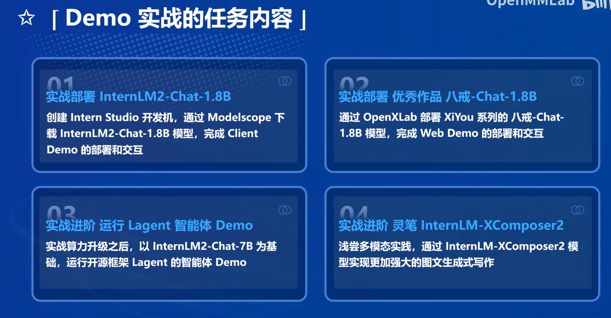

# 第二课 轻松玩转书生·浦语大模型趣味 Demo
本节课我们正式开始实战，通过在InternStudio创建开发机、部署几个已有的模型来熟悉流程。

## 1 任务内容概览
4个模型由简入繁，GPU显存占用也逐步增加。

视频教程非常详细，属于是计算机零基础也能照着傻瓜式操作的程度吧，但要想玩好的话代码还得好好看下。

### 2 书生·浦语大模型兴趣小组一览
RAG兴趣小组吸引了我的注意→_→

